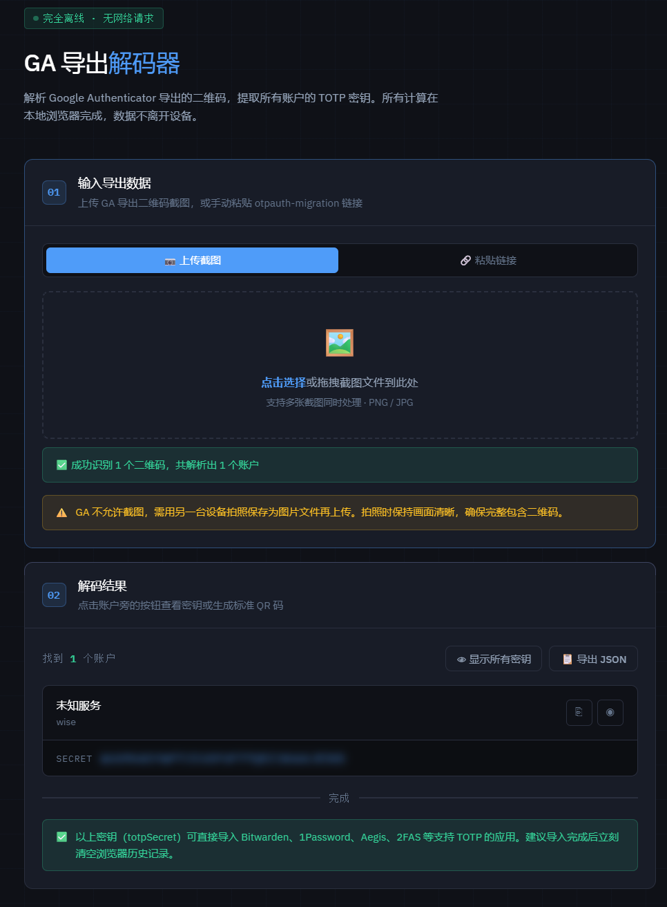

# google-authenticator-exporter-web
解析 Google Authenticator 导出的二维码，提取所有账户的 TOTP 密钥。所有计算在本地浏览器完成，数据不离开设备。显示密钥/导出JSOS

## 在线使用：
https://kukukeji8.github.io/google-authenticator-exporter-web/

## 如何使用
在线使用或者下载index.html这个文件，双击直接在浏览器打开即可。

### 两种输入方式
粘贴链接：用手机扫描 GA 导出的二维码（推荐用 Google Lens），复制得到的 otpauth-migration://offline?data=... 链接粘贴进去，点解码——完全零网络请求

上传截图：上传拍下来的二维码图片，会自动识别（首次需联网加载 ZXing 识别库约 500KB，之后浏览器缓存）

## 结果展示

所有密钥默认模糊隐藏，鼠标悬停可见，点「显示所有密钥」全部展开
每个账户可点按钮一键复制密钥，或生成标准 otpauth:// 二维码（用于导入 Aegis / 2FAS / Bitwarden 等）
支持导出完整 JSON

感谢 [krissrex/google-authenticator-exporter](https://github.com/krissrex/google-authenticator-exporter) 关于从Google二维码导出数据的逻辑。
